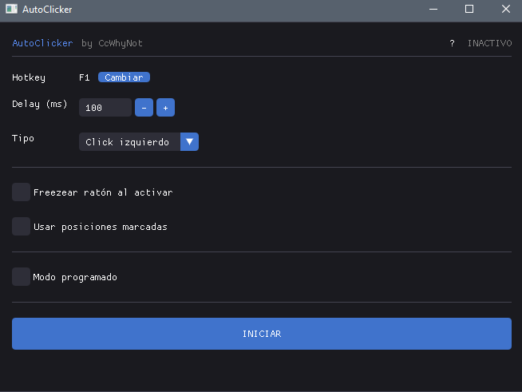
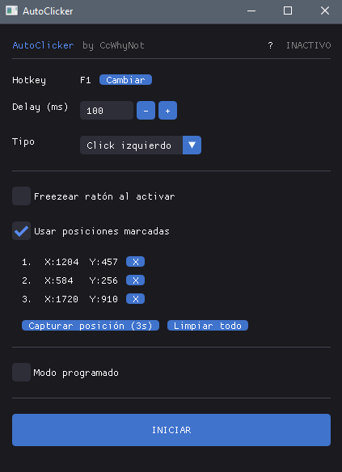
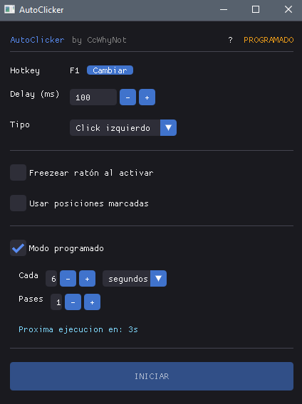

# AutoClicker

AutoClicker configurable para Windows con interfaz gráfica. Sin instalación, ejecutable único.



## Descarga

Descarga el `.exe` directamente desde [Releases](../../releases/latest). No requiere instalación ni dependencias.

> **Windows SmartScreen** puede mostrar un aviso al ejecutarlo por primera vez ("Editor desconocido").
> Haz clic en **Más información → Ejecutar de todas formas** para continuar.
> El ejecutable es open source — puedes revisar todo el código aquí mismo.

## Funcionalidades

### Click manual
- Hotkey configurable para activar/desactivar (por defecto F1)
- Delay configurable en milisegundos
- Click izquierdo o derecho
- Indicador de estado ACTIVO / INACTIVO en tiempo real

### Posiciones marcadas
Marca puntos en la pantalla y el autoclicker los cicla en orden.



- Captura de posición con cuenta atrás de 3 segundos
- Elimina posiciones individualmente o limpia toda la lista
- Compatible con freeze del ratón

### Freeze del ratón
Mantiene el cursor en la posición donde se activó el autoclicker. Útil para clicks repetidos en un punto fijo sin que el ratón se mueva.

### Modo programado
Ejecuta el patrón de posiciones automáticamente cada X segundos o minutos, sin necesidad de activar manualmente.



- Intervalo configurable en segundos (1-3600) o minutos (1-60)
- Número de pases por ejecución configurable
- Cuenta atrás hasta la próxima ejecución visible en la UI
- Exclusivo con el modo manual (no pueden estar activos a la vez)

## Compilar desde código fuente

Requisitos: **CMake 3.16+**, **Ninja**, **MSVC** (Visual Studio Build Tools).

```bash
cmake -S . -B build -G Ninja -DCMAKE_BUILD_TYPE=Release
cmake --build build --config Release
```

SDL2 e ImGui se descargan automáticamente via FetchContent. El resultado es un único `AutoClicker.exe` sin DLLs externas.

## Stack técnico

- C++17
- [SDL2](https://github.com/libsdl-org/SDL) — ventana y contexto OpenGL
- [Dear ImGui](https://github.com/ocornut/imgui) — interfaz gráfica
- OpenGL 3.3 — renderizado
- Windows API (`SendInput`, `GetAsyncKeyState`) — clicks y hotkeys
- `std::thread` + `std::atomic` — hilo de clicks thread-safe

## Licencias de terceros

Las licencias de SDL2 y Dear ImGui están disponibles dentro de la aplicación en el botón **?** de la esquina superior derecha.
